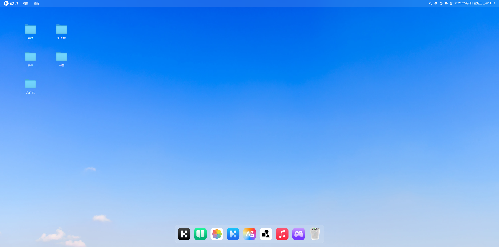

# macOS-Style Portfolio

A modern, interactive portfolio website built with React that mimics the macOS desktop experience. Features a draggable dock, window management system, and various applications including a music player, photo gallery, and more.



## ✨ Features

- **macOS-Inspired UI** - Authentic macOS window controls, dock, and animations
- **Window Management** - Draggable, minimizable, and maximizable windows
- **Interactive Applications**:
  - 🎵 Music Player with playlist support
  - 📸 Photo Gallery with masonry layout
  - 📄 Resume Viewer
  - 💼 Projects Showcase
  - ✉️ Contact Information
  - 🌐 Blog/Safari Browser
  - 🖥️ VS Code IDE
  - 💻 Terminal with Tech Stack
  - 📁 Finder File Explorer
- **Smooth Animations** - GSAP-powered transitions and interactions
- **Responsive Design** - Optimized for desktop viewing

## 🚀 Quick Start

### Prerequisites

- Node.js 18+ 
- npm or yarn

### Installation

1. Clone the repository
```bash
git clone https://github.com/yourusername/your-repo-name.git
cd your-repo-name
```

2. Install dependencies
```bash
npm install
```

3. Start development server
```bash
npm run dev
```

4. Open [http://localhost:5173](http://localhost:5173) in your browser

## 📦 Build
```bash
npm run build
```

Build output will be in the `dist/` directory.

## 🛠️ Tech Stack

- **Frontend Framework**: React 19
- **Build Tool**: Vite 7
- **Styling**: Tailwind CSS 4
- **Animations**: GSAP with Draggable plugin
- **State Management**: Zustand
- **Icons**: Lucide React
- **Fonts**: Google Fonts (Georama, Roboto Mono) via USTC mirror (fonts.loli.net)

## 📁 Project Structure
```
src/
├── components/      # Reusable UI components
├── constants/       # App configuration and data
├── hoc/            # Higher-order components (WindowWrapper)
├── store/          # Zustand state management
├── windows/        # Individual window components
└── App.jsx         # Main application component
```

## 🎨 Customization

### Adding New Songs to Music Player

Edit `src/constants/songs.js`:
```javascript
export const songs = [
  {
    id: 1,
    title: 'Your Song Title',
    cover: '/path/to/cover.jpg',
    src: '/path/to/audio.mp3'
  }
]
```

### Adding Photos to Gallery

Add images to `public/images/` and update `src/constants/photos.js`

### Customizing Wallpaper

Replace the wallpaper URL in `src/App.css`:
```css
html, body {
  background-image: url('/images/your-wallpaper.webp');
}
```

## 🖼️ Adding New Windows

1. Create a new component in `src/windows/`
2. Wrap it with `WindowWrapper` HOC
3. Add window state to Zustand store
4. Add dock icon and click handler

## 📝 Available Scripts

| Command | Description |
|---------|-------------|
| `npm run dev` | Start development server |
| `npm run build` | Build for production |
| `npm run preview` | Preview production build |
| `npm run lint` | Run ESLint |

## 🌐 Deployment

This project can be deployed to:
- Vercel
- Netlify
- Any static hosting service

Make sure to configure the base path if deploying to a subdirectory.

## 🤝 Contributing

Contributions, issues, and feature requests are welcome! Feel free to check the [issues page](link-to-issues).

## 📄 License

This project is open source and available under the [MIT License](LICENSE).

## 👤 Author

**Swastik Sharma**
- GitHub: [@github](https://github.com/)
- LinkedIn: [linkedin](https://linkedin.com/)
- Portfolio: [酷设计](https://kusheji.com)

## 🙏 Acknowledgments

- Icons by [Lucide](https://lucide.dev)
- Fonts from [Google Fonts](https://fonts.google.com)

---

⭐️ If you like this project, please give it a star on GitHub!